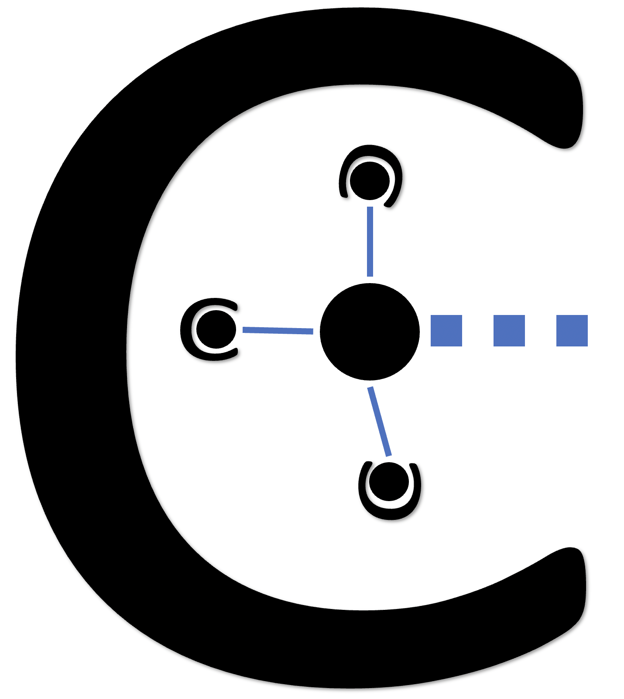

## CARMINE

The official repo of CARMINE: ContAinerized Ros MonItors geNEration.



## Table of contents

[Project info](#project-info)

[Quick start](#quick-start)
1. [Install dependencies](#dependencies)
2. [Build the project](#build-the-project)

[Optional arguments](#optional-arguments)

## Project info

This tool can be used to automatically generate a ROS-based verification environment from LTL properties.

# Quick start

For now, we support only Linux and Mac OS (both x86 and arm64) with gcc (c++17) and cmake 3.14+.

## Dependencies
* [spotLTL](https://spot.lrde.epita.fr/install.html)
* [antlr4-runtime](https://www.antlr.org)

* Install all the dependencies manually or simply run the commands below.


```
sudo apt-get install -y uuid-dev pkg-config
```

* Install all dependencies in the local repository (all the dependencies will be compiled from source);

```
cd third_party
bash install_all.sh
```


## Build the project

```
mkdir build && cd build
cmake -DCMAKE_BUILD_TYPE=Release ..
make
```


# How to use the tool  
Carmine has one main input, a configuratin file containing the LTL properties.
The user can find several input examples in the 'input' directory

## Generating the verification environment

Run the following command in the root directory of carmine:

```
./generate_env.sh specifications.xml
```

This will create the 'ver_env' catkin project inside the output directory

## The specification file
We report hereafter an example of specification file.

 ```xml
<handler>

    <checker name="Checker0" description="An example" LTLformula="G({(var1)[->1]:1}|=>{$timeout(var2==0,2000)})">
        <variable decl="bool var1">
            <rosTopic>joint_states</rosTopic>
            <msgType>sensor_msgs::JointState</msgType>
            <msgField>start</msgField>
        </variable>
        <variable decl="double var2">
            <rosTopic>joint_states</rosTopic>
            <msgType>sensor_msgs::JointState</msgType>
            <msgField>speed</msgField>
            <filter window="10">ma</filter>
        </variable>
    </checker>

</handler>
```

* All specification files must start with a 'handler' tag
* The user can define many 'checker' tags contian

# How to use the generated verification environment

The generated verification environment contained in 'ver_env' is a simple catkin project that can be compiled
following the usual ros/catkin chain.
WARNING: when compiling, 'ver_env' must know where to find the code (headers and definition) of the topics used by the verification environment

##  How to run the verification environment
Simply run the executable:

```
./devel/lib/ver_env/ver_env_node --disableNotifications --milpUsageThreshold 0.9 --milpResponsivnessThreshold 0 --topicPrefix robot/ __name:="unique_name_of_the_handler"
```

Alternatively, you can use a Ros launch file.

##  Mandatory arguments

* \_\_name:="unique_name_of_the_handler"

##  Optional arguments

* \-\-milpUsageThreshold : a float value (percentage value between 0 and 1) specifying the maximum allowed cpu usage on this running machine
* \-\-milpResponsivnessThreshold : an interger value specifying the maximum allowed delay (in milliseconds) for receiving the values from the topics
* \-\-disableMigration: it disables the migration of monitors
* \-\-disableNotifications: it disables notifications, such as a monitor failure
* \-\-topicPrefix: adds a prefix to the name of used topics

